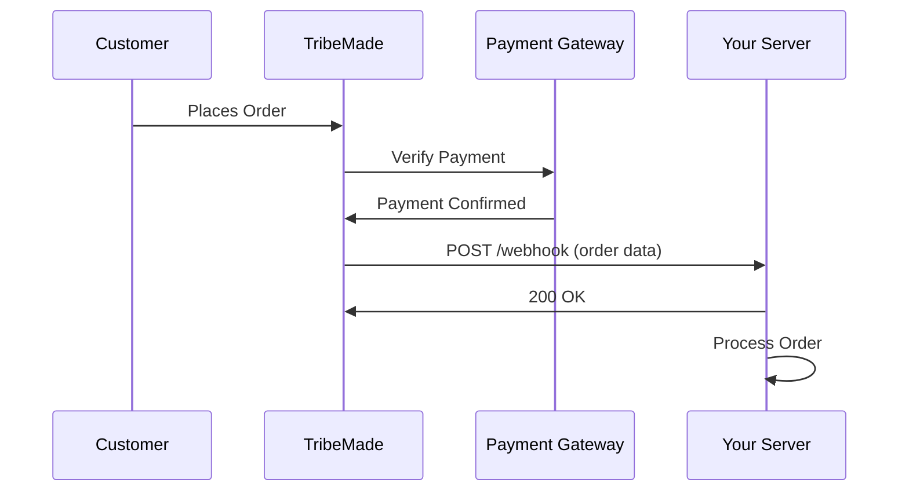

## Overview

Webhooks allow you to receive real-time notifications when events occur in your TribeMade store. When a customer successfully places an order, TribeMade automatically sends a POST request to all your configured webhook URLs with complete order details.

<Info>
  **No polling required!** Webhooks push data to you automatically, saving API calls and providing instant notifications.
</Info>

## How Webhooks Work



### Event Details

- **Event:** `order.created`
- **When:** Immediately after payment verification succeeds
- **What:** Complete order and customer details
- **Method:** POST request with JSON payload
- **Recipients:** All configured webhook URLs (up to 5)

## Configure Webhooks

### Step 1: Set Up Your Endpoint

Create an endpoint on your server to receive webhook notifications:

<CodeGroup>

```python Python (Flask)
from flask import Flask, request

app = Flask(__name__)

@app.route('/webhook/orders', methods=['POST'])
def handle_order_webhook():
    data = request.get_json()
    
    # Validate event type
    if data.get('event') != 'order.created':
        return '', 400
    
    # Extract order details
    order_id = data.get('order_id')
    customer = data.get('customer')
    order_details = data.get('order_details')
    
    # Process order asynchronously
    process_order_async(order_id, customer, order_details)
    
    # Return success quickly
    return '', 200

if __name__ == '__main__':
    app.run(port=5000)
```

```javascript Node.js (Express)
const express = require('express');
const app = express();

app.use(express.json());

app.post('/webhook/orders', (req, res) => {
    const data = req.body;
    
    // Validate event type
    if (data.event !== 'order.created') {
        return res.status(400).send();
    }
    
    // Extract order details
    const { order_id, customer, order_details } = data;
    
    // Process order asynchronously
    processOrderAsync(order_id, customer, order_details);
    
    // Return success quickly
    res.status(200).send();
});

app.listen(3000, () => {
    console.log('Webhook server running on port 3000');
});
```

```php PHP
<?php
// webhook.php

// Get POST data
$json = file_get_contents('php://input');
$data = json_decode($json, true);

// Validate event type
if ($data['event'] !== 'order.created') {
    http_response_code(400);
    exit;
}

// Extract order details
$order_id = $data['order_id'];
$customer = $data['customer'];
$order_details = $data['order_details'];

// Process order (log to file, queue, database, etc.)
processOrder($order_id, $customer, $order_details);

// Return success
http_response_code(200);
?>
```

</CodeGroup>

### Step 2: Add Webhook URL to Dashboard

1. Log in to [TribeMade Dashboard](https://tribemade.in/dashboard)
2. Navigate to **Developer** section
3. Add your webhook URL (e.g., `https://yourdomain.com/webhook/orders`)
4. You can add up to 5 webhook URLs

<Warning>
  **Important:** Your webhook endpoint must use HTTPS (not HTTP) with a valid SSL certificate.
</Warning>

### Step 3: Test Your Webhook

Place a test order in your store to verify your webhook receives the notification.

## Webhook Payload

### HTTP Request

**Method:** `POST`  
**Content-Type:** `application/json`

### Payload Structure

<ParamField body="event" type="string" required>
  Event type. Always `"order.created"` for new orders.
</ParamField>

<ParamField body="order_id" type="string" required>
  Unique order identifier (UUID)
</ParamField>

<ParamField body="store_id" type="string" required>
  Your store's unique identifier (UUID)
</ParamField>

<ParamField body="product_id" type="string" required>
  Ordered product identifier (UUID)
</ParamField>

<ParamField body="status" type="string" required>
  Order status. Always `"started"` for new orders.
</ParamField>

<ParamField body="created_at" type="string" required>
  Order creation timestamp (ISO 8601 format, UTC)
</ParamField>

<ParamField body="customer" type="object" required>
  Customer information
  <Expandable title="properties">
    <ParamField body="name" type="string" required>
      Customer's full name
    </ParamField>
    <ParamField body="email" type="string" required>
      Customer's email address
    </ParamField>
    <ParamField body="number" type="string" required>
      Customer's phone number
    </ParamField>
    <ParamField body="full_address" type="string" required>
      Complete formatted address string
    </ParamField>
    <ParamField body="pincode" type="string" required>
      Delivery pincode
    </ParamField>
  </Expandable>
</ParamField>

<ParamField body="order_details" type="object" required>
  Order details
  <Expandable title="properties">
    <ParamField body="quantity" type="integer" required>
      Quantity ordered
    </ParamField>
    <ParamField body="amount" type="number" required>
      Total amount paid in INR
    </ParamField>
    <ParamField body="variation" type="string | null">
      Selected variation (null if not applicable)
    </ParamField>
    <ParamField body="size" type="string | null">
      Selected size (null if not applicable)
    </ParamField>
    <ParamField body="color" type="string | null">
      Selected color (null if not applicable)
    </ParamField>
    <ParamField body="special_instructions" type="string | null">
      Customer instructions (null if none)
    </ParamField>
    <ParamField body="custom_questions" type="array">
      Answers to custom questions (empty array if none)
    </ParamField>
  </Expandable>
</ParamField>

### Example Payload

```json
{
  "event": "order.created",
  "order_id": "770e8400-e29b-41d4-a716-446655440789",
  "store_id": "550e8400-e29b-41d4-a716-446655440000",
  "product_id": "660e8400-e29b-41d4-a716-446655440123",
  "customer": {
    "name": "Rahul Sharma",
    "email": "rahul.sharma@example.com",
    "number": "9876543210",
    "full_address": "123, MG Road, Apartment 4B, Mumbai, Maharashtra, India",
    "pincode": "400001"
  },
  "order_details": {
    "quantity": 2,
    "amount": 2048.00,
    "variation": "Slim Fit",
    "size": "L",
    "color": "Navy Blue",
    "special_instructions": "Please gift wrap",
    "custom_questions": []
  },
  "status": "started",
  "created_at": "2024-11-16T10:30:45.123456"
}
```

## Webhook Requirements

### Your Webhook Endpoint Must:

<AccordionGroup>
  <Accordion icon="server" title="Accept POST requests">
    - Listen for POST method
    - Parse JSON request body
    - Handle `Content-Type: application/json`
  </Accordion>
  
  <Accordion icon="check" title="Return 2xx status code">
    - Any status 200-299 is considered success
    - Common: `200 OK`, `201 Created`, `202 Accepted`
    - Return quickly (within 5 seconds)
  </Accordion>
  
  <Accordion icon="clock" title="Respond within 5 seconds">
    - Timeout after 5 seconds
    - Process asynchronously if needed
    - Return response immediately, then process
  </Accordion>
  
  <Accordion icon="lock" title="Use HTTPS (required)">
    - HTTP endpoints are not accepted
    - Must have valid SSL certificate
    - Self-signed certificates won't work
  </Accordion>
</AccordionGroup>

## Example Implementations

### Complete Python Implementation

```python
from flask import Flask, request
import requests
import logging
from queue import Queue
from threading import Thread

app = Flask(__name__)
logging.basicConfig(level=logging.INFO)

# Process orders asynchronously using a queue
order_queue = Queue()

def order_processor():
    """Background thread to process orders"""
    while True:
        order_data = order_queue.get()
        try:
            process_order(order_data)
        except Exception as e:
            logging.error(f"Error processing order: {str(e)}")
        finally:
            order_queue.task_done()

# Start background processor
Thread(target=order_processor, daemon=True).start()

@app.route('/webhook/orders', methods=['POST'])
def handle_order_webhook():
    """
    Webhook endpoint for new orders
    """
    data = request.get_json()
    
    # Log webhook receipt
    logging.info(f"Received webhook: {data.get('event')}")
    
    # Validate event type
    if data.get('event') != 'order.created':
        logging.warning(f"Invalid event type: {data.get('event')}")
        return '', 400
    
    # Validate required fields
    required_fields = ['order_id', 'customer', 'order_details']
    if not all(field in data for field in required_fields):
        logging.error("Missing required fields")
        return '', 400
    
    # Queue order for processing
    order_queue.put(data)
    
    # Return success immediately
    return '', 200

def process_order(order_data):
    """
    Process order data (runs in background)
    """
    order_id = order_data['order_id']
    customer = order_data['customer']
    order_details = order_data['order_details']
    
    logging.info(f"Processing order {order_id[:8]}...")
    
    # 1. Save to database
    save_to_database(order_data)
    
    # 2. Update inventory
    update_inventory(order_data['product_id'], order_details['quantity'])
    
    # 3. Mark as processing via API
    mark_as_processing(order_id)
    
    # 4. Send to fulfillment system
    send_to_fulfillment(order_data)
    
    logging.info(f"✓ Order {order_id[:8]}... processed successfully")

def save_to_database(order_data):
    """Save order to your database"""
    # Your database logic here
    pass

def update_inventory(product_id, quantity):
    """Update product stock"""
    # Your inventory logic here
    pass

def mark_as_processing(order_id):
    """Mark order as processing via TribeMade API"""
    url = f"https://api.tribemade.in/api/orders/{order_id}/status"
    headers = {
        "X-API-Key": "tb-a1b2-c3d-e4f5",
        "Content-Type": "application/json"
    }
    data = {"status": "processing"}
    
    response = requests.put(url, headers=headers, json=data)
    if response.status_code == 200:
        logging.info(f"✓ Marked order {order_id[:8]}... as processing")

def send_to_fulfillment(order_data):
    """Send to your fulfillment system"""
    # Your fulfillment logic here
    pass

if __name__ == '__main__':
    app.run(host='0.0.0.0', port=5000)
```

### Complete Node.js Implementation

```javascript
const express = require('express');
const fetch = require('node-fetch');
const { Queue, Worker } = require('bullmq');

const app = express();
app.use(express.json());

// Create order processing queue
const orderQueue = new Queue('orders', {
    connection: {
        host: 'localhost',
        port: 6379
    }
});

// Worker to process orders in background
const worker = new Worker('orders', async (job) => {
    const orderData = job.data;
    await processOrder(orderData);
}, {
    connection: {
        host: 'localhost',
        port: 6379
    }
});

app.post('/webhook/orders', async (req, res) => {
    const data = req.body;
    
    // Validate event type
    if (data.event !== 'order.created') {
        console.warn(`Invalid event type: ${data.event}`);
        return res.status(400).send();
    }
    
    // Validate required fields
    const required = ['order_id', 'customer', 'order_details'];
    if (!required.every(field => field in data)) {
        console.error('Missing required fields');
        return res.status(400).send();
    }
    
    // Queue order for processing
    await orderQueue.add('process', data);
    
    console.log(`✓ Queued order ${data.order_id.substring(0, 8)}...`);
    
    // Return success immediately
    res.status(200).send();
});

async function processOrder(orderData) {
    const orderId = orderData.order_id;
    
    console.log(`Processing order ${orderId.substring(0, 8)}...`);
    
    try {
        // 1. Save to database
        await saveToDatabase(orderData);
        
        // 2. Update inventory
        await updateInventory(orderData.product_id, orderData.order_details.quantity);
        
        // 3. Mark as processing
        await markAsProcessing(orderId);
        
        // 4. Send to fulfillment
        await sendToFulfillment(orderData);
        
        console.log(`✓ Order ${orderId.substring(0, 8)}... processed`);
    } catch (error) {
        console.error(`✗ Error processing order: ${error.message}`);
        throw error;
    }
}

async function markAsProcessing(orderId) {
    const url = `https://api.tribemade.in/api/orders/${orderId}/status`;
    const headers = {
        'X-API-Key': 'tb-a1b2-c3d-e4f5',
        'Content-Type': 'application/json'
    };
    const data = { status: 'processing' };
    
    const response = await fetch(url, {
        method: 'PUT',
        headers: headers,
        body: JSON.stringify(data)
    });
    
    if (response.ok) {
        console.log(`✓ Marked order ${orderId.substring(0, 8)}... as processing`);
    }
}

async function saveToDatabase(orderData) {
    // Your database logic
}

async function updateInventory(productId, quantity) {
    // Your inventory logic
}

async function sendToFulfillment(orderData) {
    // Your fulfillment logic
}

app.listen(3000, () => {
    console.log('Webhook server running on port 3000');
});
```

## Security Best Practices

<AccordionGroup>
  <Accordion icon="lock" title="Always use HTTPS">
    - **Never** use HTTP endpoints
    - Ensure valid SSL certificate
    - Self-signed certificates won't work
    - HTTPS protects customer data in transit
  </Accordion>
  
  <Accordion icon="check-double" title="Validate data structure">
    Always validate webhook payload before processing:
    
    ```python
    def is_valid_webhook(data):
        # Check event type
        if data.get('event') != 'order.created':
            return False
        
        # Check required fields
        required = ['order_id', 'customer', 'order_details']
        if not all(field in data for field in required):
            return False
        
        # Check customer fields
        customer_required = ['name', 'email', 'number', 'pincode']
        if not all(field in data['customer'] for field in customer_required):
            return False
        
        return True
    ```
  </Accordion>
  
  <Accordion icon="database" title="Store raw webhooks">
    Save original webhook payload for debugging and audit trails:
    
    ```python
    import json
    from datetime import datetime
    
    def log_webhook(data):
        timestamp = datetime.utcnow().isoformat()
        filename = f"webhooks/{timestamp}_{data['order_id'][:8]}.json"
        
        with open(filename, 'w') as f:
            json.dump(data, f, indent=2)
    ```
  </Accordion>
  
  <Accordion icon="shield" title="Handle duplicates">
    Same webhook may be sent multiple times. Use order_id to prevent duplicate processing:
    
    ```python
    processed_orders = set()
    
    def process_order(order_id, order_data):
        # Check if already processed
        if order_id in processed_orders:
            logging.info(f"Order {order_id[:8]}... already processed")
            return
        
        # Process order
        # ...
        
        # Mark as processed
        processed_orders.add(order_id)
    ```
  </Accordion>
  
  <Accordion icon="chart-line" title="Monitor webhook health">
    Track webhook delivery and processing:
    - Success/failure rates
    - Processing time
    - Error patterns
    - Alert on failures
  </Accordion>
</AccordionGroup>

## Performance Best Practices

<AccordionGroup>
  <Accordion icon="bolt" title="Return 200 quickly">
    Process webhooks asynchronously to respond within 5 seconds:
    
    **❌ Bad: Synchronous processing**
    ```python
    @app.route('/webhook', methods=['POST'])
    def handle_webhook():
        data = request.get_json()
        
        # This takes too long!
        save_to_database(data)
        update_inventory(data)
        create_shipping_label(data)
        send_notifications(data)
        
        return '', 200  # Might timeout!
    ```
    
    **✅ Good: Asynchronous processing**
    ```python
    @app.route('/webhook', methods=['POST'])
    def handle_webhook():
        data = request.get_json()
        
        # Queue for background processing
        order_queue.put(data)
        
        # Return immediately
        return '', 200
    ```
  </Accordion>
  
  <Accordion icon="layer-group" title="Use queues for processing">
    Implement a queue system (RabbitMQ, Redis, Celery, BullMQ):
    - Webhook returns 200 immediately
    - Background workers process orders
    - Handle high-volume periods
    - Retry failed processing
  </Accordion>
  
  <Accordion icon="rotate" title="Implement retry logic">
    Retry failed operations with exponential backoff:
    
    ```python
    import time
    
    def process_with_retry(func, max_retries=3):
        for attempt in range(max_retries):
            try:
                return func()
            except Exception as e:
                if attempt == max_retries - 1:
                    raise
                wait_time = 2 ** attempt
                time.sleep(wait_time)
    ```
  </Accordion>
  
  <Accordion icon="gauge" title="Monitor processing time">
    Track how long webhook processing takes:
    
    ```python
    import time
    
    @app.route('/webhook', methods=['POST'])
    def handle_webhook():
        start_time = time.time()
        
        # Process webhook
        data = request.get_json()
        order_queue.put(data)
        
        # Log processing time
        duration = time.time() - start_time
        logging.info(f"Webhook processed in {duration:.3f}s")
        
        return '', 200
    ```
  </Accordion>
</AccordionGroup>

## Troubleshooting

### Common Issues

<AccordionGroup>
  <Accordion icon="circle-xmark" title="Endpoint returns 404/500">
    **Cause:** Endpoint not found or server error
    
    **Fix:**
    - Verify URL is correct
    - Check server is running
    - Review server logs for errors
    - Test endpoint with curl or Postman
  </Accordion>
  
  <Accordion icon="clock" title="Endpoint times out (>5 seconds)">
    **Cause:** Processing takes too long
    
    **Fix:**
    - Process asynchronously
    - Return 200 immediately
    - Use background queue
    - Optimize database queries
  </Accordion>
  
  <Accordion icon="lock-open" title="Using HTTP instead of HTTPS">
    **Cause:** Endpoint URL starts with http://
    
    **Fix:**
    - Use HTTPS URL with valid SSL
    - Get SSL certificate (Let's Encrypt is free)
    - Configure server for HTTPS
  </Accordion>
  
  <Accordion icon="shield-halved" title="Invalid SSL certificate">
    **Cause:** Expired or self-signed certificate
    
    **Fix:**
    - Use valid SSL from trusted CA
    - Renew expired certificates
    - Don't use self-signed certificates
  </Accordion>
  
  <Accordion icon="ban" title="Webhook not received">
    **Causes:**
    - Endpoint not configured in dashboard
    - Server is down or unreachable
    - Firewall blocking requests
    - Port not open
    
    **Fix:**
    - Verify webhook URL in dashboard
    - Check server status
    - Configure firewall rules
    - Ensure port is accessible
  </Accordion>
</AccordionGroup>

### Testing Webhooks

<AccordionGroup>
  <Accordion icon="flask" title="Use webhook testing tools">
    Test your endpoint before going live:
    
    1. **Webhook.site:** [https://webhook.site](https://webhook.site)
       - Get instant webhook URL
       - Inspect raw requests
       - No server setup needed
    
    2. **RequestBin:** [https://requestbin.com](https://requestbin.com)
       - Similar to webhook.site
       - View request details
    
    3. **ngrok:** Expose local server to internet
       ```bash
       ngrok http 5000
       # Use generated HTTPS URL in dashboard
       ```
  </Accordion>
  
  <Accordion icon="terminal" title="Test with curl">
    Simulate webhook locally:
    
    ```bash
    curl -X POST http://localhost:5000/webhook/orders \
      -H "Content-Type: application/json" \
      -d '{
        "event": "order.created",
        "order_id": "770e8400-e29b-41d4-a716-446655440789",
        "customer": {
          "name": "Test Customer",
          "email": "test@example.com",
          "number": "9876543210",
          "full_address": "123 Test St, Test City",
          "pincode": "400001"
        },
        "order_details": {
          "quantity": 1,
          "amount": 500
        },
        "status": "started",
        "created_at": "2024-11-16T10:30:45.123456"
      }'
    ```
  </Accordion>
  
  <Accordion icon="cart-shopping" title="Place test order">
    The most reliable test:
    1. Create test product in your store
    2. Place order as customer
    3. Verify webhook received
    4. Check all fields present
    5. Validate processing works
  </Accordion>
</AccordionGroup>

## Webhook vs. Polling

### Why Webhooks Are Better

| Aspect | Webhooks | Polling |
|--------|----------|---------|
| **Latency** | Instant (< 1 second) | 1-5 minutes delay |
| **API Calls** | 0 calls needed | Hundreds/day |
| **Server Load** | Minimal | High |
| **Rate Limits** | Not affected | Quickly exceeded |
| **Complexity** | Low | Medium |
| **Real-time** | ✅ Yes | ❌ No |

### Example: Cost Comparison

**Scenario:** 100 orders per day

**With Polling (every minute):**
- API calls per day: 1,440 (24 hours × 60 minutes)
- Most calls return no new orders
- Wastes API rate limit
- Delayed notifications

**With Webhooks:**
- API calls per day: 0
- Instant notifications
- No wasted calls
- Better customer experience

## Next Steps

<CardGroup cols={2}>
  <Card
    title="Get Order Details"
    icon="magnifying-glass"
    href="/api-reference/orders/get-details"
  >
    Fetch complete order information after webhook
  </Card>
  <Card
    title="Update Order Status"
    icon="truck"
    href="/api-reference/orders/update-status"
  >
    Update order status and add tracking
  </Card>
  <Card
    title="Authentication"
    icon="shield-halved"
    href="/api-reference/authentication"
  >
    Learn about API authentication
  </Card>
  <Card
    title="Error Handling"
    icon="triangle-exclamation"
    href="/api-reference/errors"
  >
    Handle webhook errors gracefully
  </Card>
</CardGroup>

